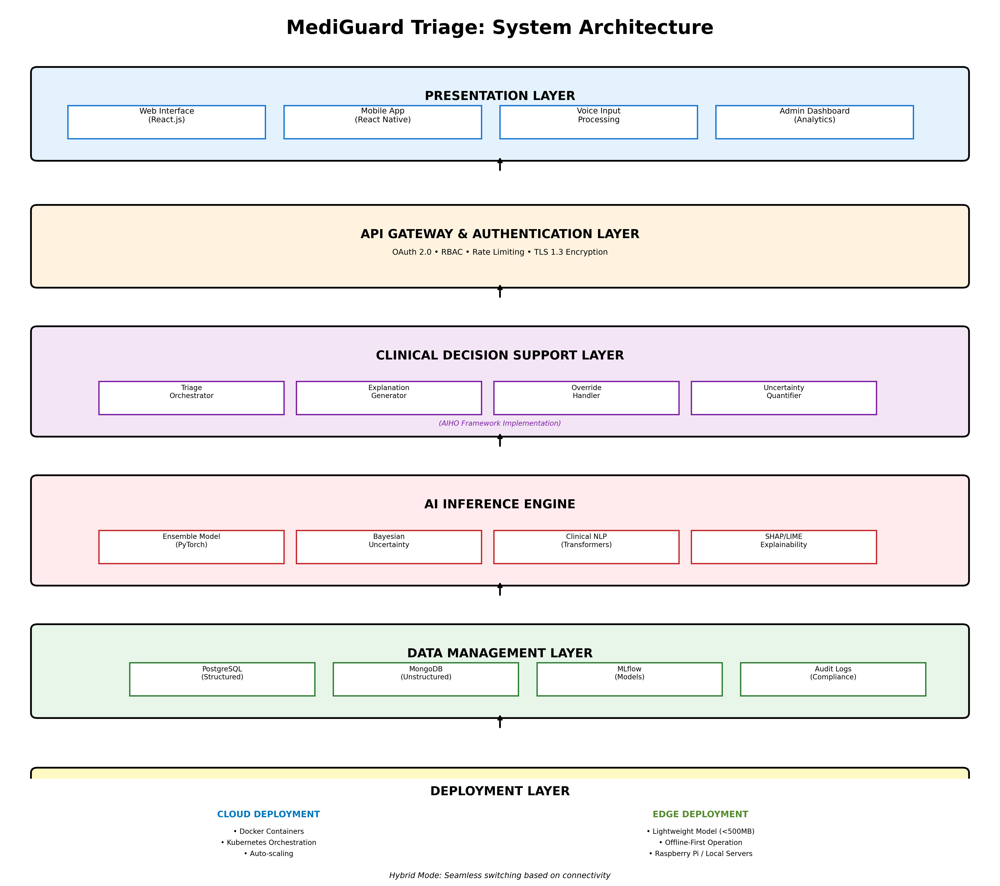

# MediGuard Triage

**AI-Powered Emergency Triage Assistant with Built-in Safety Mechanisms**

## Overview

MediGuard Triage is an uncertainty-aware AI system for emergency department triage that addresses the critical trust gap preventing clinical AI adoption. Built on the AI-Instigated Human Oversight (AIHO) framework published at AAAI 2026, the system embeds transparency, uncertainty quantification, and human oversight as core architectural principles.

**The Problem:** Indian emergency departments operate at 40-60% over capacity with 15-20% of triage decisions leading to preventable adverse events. Existing AI tools are "black boxes" that clinicians refuse to adopt.

**Our Solution:** Transparent AI that explicitly shows confidence scores, automatically flags ambiguous cases for human review, and provides plain-language clinical reasoning grounded in established medical guidelines.

## Key Features

- 🎯 **Intelligent Triage Classification** - Emergent/Urgent/Non-Urgent with <3 second response time
- 🔍 **Uncertainty Quantification** - Bayesian methods flag low-confidence predictions (<70%)
- 💡 **Explainable Recommendations** - Plain-language reasoning referencing ICMR/AHA/ESC guidelines
- 👥 **Human Oversight Integration** - Override mechanism with continuous learning from feedback
- 📱 **Multi-Modal Interface** - Voice input in English, Hindi, Bengali, Tamil
- 📡 **Offline-First Architecture** - Full functionality without internet for rural deployment
- 📊 **Continuous Monitoring** - Real-time performance tracking and model drift detection

## Architecture

**6-Layer Microservices Architecture:**

1. **Presentation Layer** - React web, React Native mobile, voice input, admin dashboard
2. **API Gateway** - OAuth 2.0, RBAC, rate limiting, TLS 1.3
3. **Clinical Decision Support** - Triage orchestration, explanation generation, AIHO framework
4. **AI Inference Engine** - Ensemble models, Bayesian uncertainty, clinical NLP, SHAP explainability
5. **Data Management** - PostgreSQL (structured), MongoDB (unstructured), MLflow (models)
6. **Deployment** - Cloud (Docker/Kubernetes) + Edge (Raspberry Pi, offline-first)

## Technology Stack

**Frontend:** React.js, React Native, Tailwind CSS  
**Backend:** Python FastAPI, PostgreSQL, MongoDB  
**ML/AI:** PyTorch, Scikit-learn, Hugging Face Transformers, SHAP/LIME  
**Cloud:** AWS (Bedrock, Lambda, S3, SageMaker, RDS)  
**Deployment:** Docker, Kubernetes (cloud), Edge devices (rural)

## Use Cases

### High-Confidence Triage
Patient presents with clear symptoms (BP 180/110, severe headache, visual disturbances). System analyzes with 92% confidence → Recommends EMERGENT status → Clinician confirms → Patient routed to critical care.

### Ambiguous Case Detection
Patient with atypical chest pain presentation. System confidence only 68% → **Flags as uncertain** → Explains differential (cardiac vs. non-cardiac) → Escalates to senior clinician → Prevents missed diagnosis.

### Continuous Learning
Clinician overrides AI recommendation with expert reasoning → System logs feedback → Pattern analysis identifies model weakness → Automatic retraining triggered when override rate >15%.

## Research Foundation

Built on the **AI-Instigated Human Oversight (AIHO) framework** accepted at AAAI 2026 AIMedHealth Bridge.

<!-- S. S. Roy (2026). "AI-Instigated Human Oversight: A Framework for Autonomous Human Intervention Triggering in Clinical AI Systems." *Proceedings of the 40th AAAI Conference on Artificial Intelligence*.-->

The framework addresses a critical gap: most clinical AI fails not from poor accuracy but from lack of trust. AIHO enables systems to know when they don't know and autonomously trigger human oversight for ambiguous cases.

## Project Status

**Current Phase:** Prototype Development (AI for Bharat Hackathon - Feb 2025)

- [x] Research foundation (AIHO framework - AAAI 2026)
- [x] Technical specifications (requirements.md, design.md)
- [x] UI/UX wireframes and system architecture
- [x] Data strategy (MIMIC-IV, eICU, Synthea synthetic data)
- [ ] AWS infrastructure deployment
- [ ] Core triage model with uncertainty quantification
- [ ] Bedrock integration for explanation generation
- [ ] React frontend + Lambda API backend
- [ ] End-to-end testing with synthetic patient data

**Target:** Working prototype by end of February 2025

## Impact Metrics (12-Month Targets)

- **Triage Accuracy:** >90% agreement with senior clinician gold standard
- **Sensitivity for Emergent Cases:** >95% (minimize false negatives)
- **Wait Time Reduction:** 20-30% through better prioritization
- **Adverse Event Reduction:** 30-40% fewer triage-related errors
- **Patients Served:** 10,000+ in first year across 5-10 pilot hospitals

## Deployment Strategy

**Phase 1 (Months 1-6):** Bootstrap MVP development with AWS credits  
**Phase 2 (Months 7-12):** Research pilots with 2-3 teaching hospitals  
**Phase 3 (Year 2+):** Government partnerships, private hospital SaaS, international expansion

**Cost:** $6,500 total (Prototype: $500, MVP: $2,500, Pilot: $3,500)

## Documentation

- [Requirements Specification](requirements.md) - Detailed functional and non-functional requirements
- [Design Document](design.md) - System architecture, components, data models
- [Process Flow Diagram](diagrams/diagram_1_process_flow.png)
- [UI Mockup](diagrams/diagram_3_ui_mockup.png)
<!-- [Use Case Diagram](diagrams/diagram_4_use_case.png)-->

## Contributing

This project is currently in active development for the AI for Bharat Hackathon. Contributions, feedback, and collaboration opportunities are welcome.

For hospital partnerships, research collaborations, or technical discussions, please reach out.

## License

MIT License - See [LICENSE](LICENSE) for details

## Contact

Sera Singha Roy

---

*Building trustworthy AI for healthcare, one triage decision at a time.*
